<picture>
  <source media="(prefers-color-scheme: dark)" srcset="docs/assets/banner-dark.svg">
  
</picture>

<p align="center">
  <a href="https://github.com/aeljandro2/esp32-psram-stl/actions/workflows/ci.yml"></a>
  
  
  
  
  <a href="LICENSE"></a>
</p>

An ESP32 has a few hundred KB of internal RAM and, on many modules, megabytes of PSRAM next to it. The standard containers only know about the first. **esp32-psram-stl** hands them the second: one include, the same `std::` API, and your vectors, maps, strings, and objects live in PSRAM.

```cpp
#include <PsramStl.h>

psram::vector<float> samples(1'000'000);          // 4 MB of floats: PSRAM
psram::map<int, psram::string> names;              // tree nodes and long strings: PSRAM
auto frame = psram::make_unique<Frame>();          // your object: PSRAM
psram::fallback::vector<int> safe;                 // PSRAM first, internal RAM if full
```

- **Every standard container:** `vector`, `deque`, `list`, `forward_list`, `map`, `multimap`, `set`, `multiset`, all four `unordered_` ones, and `string`.
- **Your own objects:** `make_unique`, `make_shared`, and a base class that sends `new YourType` to PSRAM.
- **Two policies:** PSRAM only, or PSRAM first with internal RAM as the fallback.
- **Diagnostics:** free space, largest block, high-water mark, "is this pointer in PSRAM?", heap integrity.
- **Header-only C++17, no dependencies.** Arduino IDE, PlatformIO, and ESP-IDF.
- **Tested hard:** 21 host tests under AddressSanitizer and UBSan, plus on-device tests on a simulated ESP32 and ESP32-S3 with heap poisoning on. See [How it is tested](#how-it-is-tested).

## Quick start

### Arduino IDE

1. Install the library: *Sketch > Include Library > Add .ZIP Library* with the [latest release](https://github.com/aeljandro2/esp32-psram-stl/releases). (Library Manager listing is pending.)
2. Turn PSRAM on: *Tools > PSRAM > Enabled* (ESP32) or *OPI PSRAM* (ESP32-S3 modules with octal PSRAM, such as N8R8).
3. Open *File > Examples > ESP32 PSRAM STL > QuickStart*.

```cpp
#include <PsramStl.h>

void setup() {
  Serial.begin(115200);
  if (!psram::begin(Serial)) return;  // prints a report, or how to enable PSRAM

  psram::vector<float> samples;
  samples.reserve(1000000);           // 4 MB
  for (int i = 0; i < 1000000; ++i) samples.push_back(i * 0.5f);
  Serial.printf("in PSRAM: %s\n", psram::is_psram(samples.data()) ? "yes" : "no");
}

void loop() {}
```

### PlatformIO

```ini
lib_deps = https://github.com/aeljandro2/esp32-psram-stl.git#v2.0.0
build_flags = -DBOARD_HAS_PSRAM
```

### ESP-IDF

Add the component to your `main/idf_component.yml`, then enable `CONFIG_SPIRAM` in menuconfig:

```yaml
dependencies:
  esp32-psram-stl:
    git: https://github.com/aeljandro2/esp32-psram-stl.git
    version: v2.0.0
```

```cpp
#include <PsramStl.h>

extern "C" void app_main() {
    psram::map<int, psram::string> names;
    names[1] = "a name long enough to leave the small-string buffer";
    psram::report();
}
```

A complete project lives in [`extras/esp-idf/hello_psram`](extras/esp-idf/hello_psram).

## Where every byte lives

<picture>
  <source media="(prefers-color-scheme: dark)" srcset="docs/assets/where-bytes-live-dark.svg">
  
</picture>

A container is a small header (pointers and counters) plus the memory it manages. The header lives where you declare it: on the stack, inside another object, or in a global. Everything the container allocates goes to PSRAM. Short strings fit in the header's inline buffer and never allocate at all.

## Cheat sheet

| Instead of | Write | Notes |
|---|---|---|
| `std::vector<T>` | `psram::vector<T>` | Also `deque`, `list`, `forward_list` |
| `std::map<K, V>` | `psram::map<K, V>` | Also `multimap`, `set`, `multiset`; custom comparators work |
| `std::unordered_map<K, V>` | `psram::unordered_map<K, V>` | Also `unordered_set` and the `multi` versions; custom hashes work |
| `std::string` | `psram::string` | Or `psram::basic_string<CharT>` |
| `std::make_unique<T>(...)` | `psram::make_unique<T>(...)` | Returns `psram::unique_ptr<T>` |
| `std::make_shared<T>(...)` | `psram::make_shared<T>(...)` | Object and reference counts in one PSRAM block |
| `new T` | `class T : public psram::resident` | Every `new T`, `new T[n]`, and `new (std::nothrow) T` |
| `std::allocator<T>` | `psram::allocator<T>` | For any other allocator-aware type |

Every name also exists under `psram::fallback::`, which prefers PSRAM and falls back to internal RAM.

## Two policies

| | `psram::` | `psram::fallback::` |
|---|---|---|
| Where memory comes from | PSRAM only | PSRAM, then internal RAM |
| When PSRAM is full | `std::bad_alloc` (or log and `abort()` when exceptions are off) | Uses internal RAM; fails only when both are full |
| Use it for | Data that must not eat internal RAM | Data that must exist, wherever it fits |

Log every out-of-memory event before it is raised:

```cpp
psram::set_oom_handler([](size_t bytes) { Serial.printf("PSRAM full: %u bytes\n", (unsigned)bytes); });
```

## Your own objects

```cpp
auto sensor = psram::make_unique<Sensor>(pin);      // unique ownership, object in PSRAM
auto model  = psram::make_shared<Model>();          // shared ownership, one PSRAM block

class ImageBuffer : public psram::resident {        // empty base: adds no bytes
  uint16_t pixels[320 * 240];                        // every `new ImageBuffer` lands in PSRAM
};
```

For class hierarchies, derive the base from `psram::resident` and keep `std::unique_ptr<Base>`: the virtual destructor frees the right address. `psram::unique_ptr` refuses to convert to a base-class pointer on purpose, because C++ does not guarantee that a base sits at offset zero.

## Diagnostics

```cpp
psram::heap_info h = psram::info();   // total, free, largest_block, minimum_free
psram::is_psram(ptr);                  // does this pointer live in external RAM?
psram::check_integrity();              // walks the PSRAM heap, reports corruption
psram::report(Serial);                 // one-line summary (or psram::report() with printf)
```

## Rules of thumb

- **`reserve()` what you can.** A vector that grows by `push_back` frees its old buffer at every step. Many small ones growing at once leave gaps that shrink the largest free block. The [Diagnostics example](examples/Diagnostics/Diagnostics.ino) shows the difference.
- **Keep ISR and DMA data in internal RAM.** Interrupt handlers that run while the flash cache is disabled cannot read PSRAM, and some DMA engines cannot reach it. Leave those buffers on `std::` containers or `heap_caps_malloc(..., MALLOC_CAP_DMA)`.
- **Hot, small data may be faster in internal RAM.** PSRAM goes through a cache over SPI. Big buffers and large collections are where it shines. Measure on your hardware.
- **Globals:** the container header of a global stays in internal RAM. On ESP-IDF, `EXT_RAM_BSS_ATTR` moves it too (with `CONFIG_SPIRAM_ALLOW_BSS_SEG_EXTERNAL_MEMORY`).
- **Threads:** allocation is thread-safe (the ESP-IDF heap locks). Containers are not, exactly like `std::`: guard shared ones with a mutex.

## How it is tested

| Layer | What runs | What it proves |
|---|---|---|
| Host | 21 tests against a simulated ESP32 heap, built with AddressSanitizer and UBSan, on GCC and Clang | Every byte comes from the right heap; no leaks; out-of-memory paths; alignment; identical results to `std::` under 50,000 random operations; guard bytes around every block stay intact |
| Device | 11 tests on ESP32 (4 MB quad PSRAM) and ESP32-S3 (8 MB octal PSRAM), simulated in [Wokwi](https://wokwi.com), with ESP-IDF heap poisoning on | Data physically in PSRAM; exact free size before and after each test; heap integrity after each test; a 1 MB pattern that survives other allocations; filling PSRAM completely and recovering; both cores allocating at once |
| Build | Arduino-ESP32 examples on ESP32 and ESP32-S3; the ESP-IDF example with exceptions off; Arduino Library Manager lint | It compiles where people use it |

The tests were checked by breaking the library on purpose: routing allocations to internal RAM or ignoring alignment makes them fail. Simulation does not measure speed, so there are no timing claims here yet. Details in [docs/testing.md](docs/testing.md).

## Compatibility

| | Status |
|---|---|
| ESP32, ESP32-S3 | Tested (simulated hardware, see above) |
| ESP32-S2, ESP32-C5, ESP32-P4 | Expected to work (same ESP-IDF heap API), not yet tested |
| ESP32-C3, ESP32-C6, ESP32-H2 | No PSRAM on these chips |
| Arduino-ESP32 | 3.x (C++17 required) |
| ESP-IDF | 5.x |

## Upgrading from 1.x

Version 1 was a single sketch with a `PSallocator` that supported `std::vector` well. Version 2 is a rewrite:

- `PSallocator<T>` becomes `psram::allocator<T>`, or just use `psram::vector<T>`.
- Node-based containers now work: the allocator is always-equal and fully rebindable, which `map`, `set`, `list`, and the unordered containers need.
- Allocation goes through `heap_caps_malloc(MALLOC_CAP_SPIRAM)` instead of `ps_malloc()`, so it works in plain ESP-IDF too, not only in Arduino.
- A failed allocation raises `std::bad_alloc` instead of returning `nullptr` (which the standard containers cannot handle).

## Documentation

- [Guide](docs/guide.md): how it works, policies, strings, objects, globals, fragmentation, multi-core.
- [API reference](docs/api.md): every public name.
- [Testing](docs/testing.md): run the host tests, the device tests, and Wokwi on your machine.
- [FAQ](docs/faq.md)

## License

MIT, see [LICENSE](LICENSE). Made by [Manuel Núñez](https://github.com/aeljandro2).
